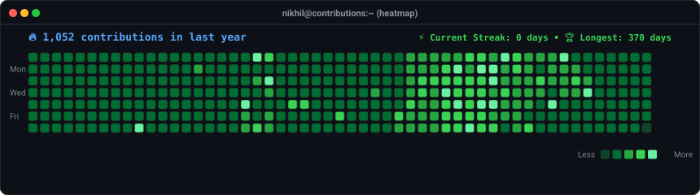
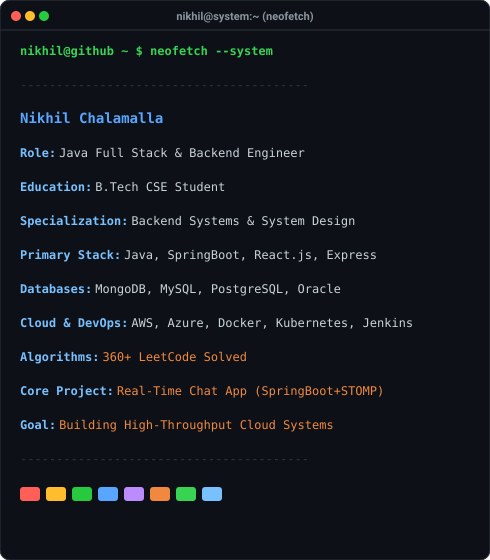
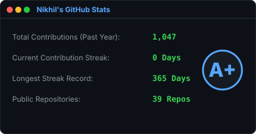
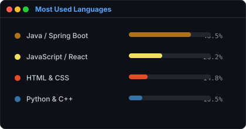

<div align="center">

<h3><code>nikhil@github ~ $ ./contributions.sh</code></h3>

<a href="https://github.com/nikhilchalamalla">
  
</a>

<br><br>

<h3><code>nikhil@github ~ $ whoami</code></h3>

<table>
  <tr>
    <td valign="top" align="center" width="45%">
      
    </td>
    <td valign="top" align="center" width="55%">
      
    </td>
  </tr>
</table>

</div>

<br>

---

## 💫 About Me

Hi 👋 I'm **Nikhil **! A passionate **Java Full Stack Developer** and **Backend Systems Engineer** pursuing my B.Tech in Computer Science & Engineering.

I specialize in building high-throughput, resilient backend services, scalable distributed systems, and modern full-stack web applications. I thrive at the intersection of algorithmic efficiency and clean software architecture.

- 💻 **Core Domain**: Backend Engineering, RESTful APIs, Microservices & System Design
- 🧠 **Problem Solving**: **360+ LeetCode problems solved** focusing on Data Structures & Algorithms
- 🛠️ **Current Focus**: Architecting real-time communication systems & cloud-native backends
- 🎯 **Career Goals**: Designing enterprise-scale, low-latency software & AI-powered applications

---

## 🚀 My Developer Journey & Technical Focus

```
     ┌─────────────────────────────────────────────────────────────┐
     │  B.Tech CSE Student  ►  Java Full Stack & Backend Specialist│
     └──────────────────────────────┬──────────────────────────────┘
                                    │
    ┌───────────────────────────────┴──────────────────────────────┐
    │                       TECHNICAL PILLARS                      │
    ├───────────────────────────────┬──────────────────────────────┤
    │  Backend & Microservices      │  Data Structures & Algo      │
    │  Spring Boot, Java, Node.js   │  360+ LeetCode Solved        │
    ├───────────────────────────────┼──────────────────────────────┤
    │  Real-Time Architecture       │  Cloud & DevOps Infrastructure│
    │  WebSockets, STOMP, Async     │  AWS, Azure, Docker, K8s     │
    └───────────────────────────────┴──────────────────────────────┘
```

My engineering journey is driven by a deep curiosity for how large-scale backends handle concurrency, data persistence, and high availability. Whether it's crafting real-time WebSocket pipelines in Spring Boot, designing schema models in MongoDB/MySQL, or deploying containerized environments with Docker and Kubernetes, I build software designed to perform and scale.

---

## 🛠️ Tech Stack & Ecosystem

### 🔹 Core Languages & Runtime


### 🔹 Backend Architecture & Frameworks


### 🔹 Frontend Development


### 🔹 Databases & Persistence


### 🔹 Cloud, DevOps & Engineering Tools


---

## 📌 Featured Engineering Projects

### 💬 [Real-Time Chat Application](https://github.com/nikhilchalamalla/Real-Time-Chat-Application)
> A high-performance real-time messaging application designed for low-latency communication.
- **Key Tech**: Java, Spring Boot, WebSockets (STOMP Protocol), MongoDB, HTML/CSS.
- **Features**: Event-driven real-time message broadcasting, room-based chatting, connection state management, persistent chat logs.

---

## 📊 GitHub Analytics & Performance

<div align="center">
  
  
</div>

<br>

---

## 🌐 Connect & Collaborate

<div align="center">

[](https://linkedin.com/in/nikhilchalamalla)
[](https://github.com/nikhilchalamalla)
[](https://leetcode.com/u/nikhilchalamalla)
[](mailto:nikhilchalamalla@example.com)

---
*Architecting scalable software, one commit at a time. 🚀*
</div>
